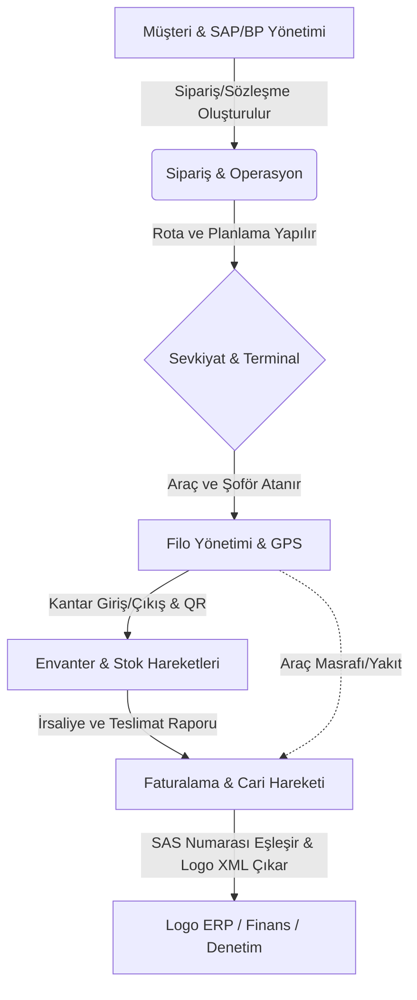

# Lojistik ERP Projesi Çekirdek Mimari Dokümanı
Bu doküman projenin saf ve basitleştirilmiş ("Sadeleştirilmiş") mimarisini, ana iş akışlarını, kullanılan bileşenleri ve arayüz (UI) standartlarını özetler. Yeni bir proje inşasında referans alınması için optimize edilmiştir.

## [İkon: architecture] 1. Ana İş Akışı (Core Workflow) & Proje Krokisi
Sistem temel olarak **Sipariş** alınması, bu siparişin uygun **Araç/Personel** ile eşleştirilerek **Sevkiyata (Shipment)** dönüştürülmesi ve teslimat sonrası işlemlerin **Finans (Fatura/Cari)** modülüne aktarılması prensibiyle çalışır.

Projenin kuş bakışı kroki modeli (Lojistik ERP İşlem Zinciri) aşağıdaki gibidir:

- **9. Raporlama ve Analiz Modülü (Reporting):**
  - **Kırılımlar:** Teslimat Raporları, Müşteri Bazlı Kar-Zarar, Araç Verimlilik Raporları, **Faturalama Öncesi Teyit Raporları (Billing Preview)**.
  - **Reaktif Bağlar:** Tarih aralığı ve "Malzeme/Gemi Kodu" seçilince anlık tonaj ve navlun özetleri hesaplanır.
  - **Operasyonel KPI'lar:** Tesis Giriş-Çıkış Süre Analizi (Loading/Unloading Performance), Araç Doluluk Oranları, Kantar Fark Analizi.

---

## [İkon: vpn_key] 6. Dijital Teslimat Anahtarı (PIN / Teslim Alma No) ve Sevkiyat Ataması
Fabrikalardan/Tesislerden ürün yükleyebilmek için gerekli olan yasal ve operasyonel "Teslim Alma Numaraları" (Örn: 864450789) sistemde dijital birer yetki anahtarı olarak yönetilir.

## Lojistik Kritik Terimler &   (Antigravity Global Guide)
PROMPT_OPTIMIZER, şu kavramları "Global Standart" düzeyinde kodlar:
- **PIN / Teslimat No:** 8-9 haneli dijital yetki anahtarı.
- **SAS / PO:** Satınalma Siparişi referansı (Mutlak eşleşme gerektirir).
- **Fuel Anomaly:** %15 uyumsuzluk denetimi (Hırsızlık önleme).
- **Fatigue AI:** Sürüş süresi bazlı operasyonel blokaj (Hard-stop).
- **iPOD:** QR + GPS + Photo mühürlü teslimat kanıtı.
- **CBAM Raporu:** Karbon salınımı yasal beyanı.
- **Tevkifat / 2-10:** Nakliye faturası yasal rejimi.

### 6.1. Teslim Numarası (PIN) Havuzu ve Excel Entegrasyonu
Haftalık veya günlük gelen Excel listelerindeki her bir satır, kendine has (UNIQUE) bir **Teslimat Numarası** ile gelir:
- **PIN Havuzu:** Excel'den içeri aktarılan (Import) bu numaralar, sistemde "Kullanılmaya Hazır / Bekleyen Yetki" statüsünde depolanır.
- **Sipariş Bağlantısı:** Her teslim numarası, bağlı olduğu SAP Satınalma Siparişi (SAS) ve Ürün Cinsi (CEM I, Klinker vb.) ile eşleşmiş haldedir.

### 6.2. Sevkiyatçı (Dispatcher) Atama ve Şoför Bildirim Akışı
Sevkiyatçının (Dispatcher), Excel'deki bu numaraları manuel olarak (kâğıtla/WhatsApp ile) şoförlere verme zahmeti dijitalleşir:
1. **Dijital Atama (Direct Assignment):** Sevkiyatçı, sistem panelinde bir araç/şoför seçtiğinde; havuzdaki uygun **Teslimat Numarasını** bir butonla o şoföre "Zimmetler".
2. **Anlık Bildirim (Driver Notification):** Atama yapıldığı anda şoförün mobil uygulamasına (veya otomatik WhatsApp botu üzerinden) *"864450789 nolu teslimat PIN'i ile [Fabrika Adı] tesisinden dolum yapınız"* bilgisi anlık düşer.
3. **PIN/QR Dönüşümü:** Şoför fabrikaya vardığında cihazındaki Teslimat Numarasını dijital olarak gösterir. Sistem gerekirse bu numarayı bir **Kullan-At QR Koda** çevirerek kantar girişinde okutulmasını sağlar.
4. **Kullanım Doğrulaması:** Kantar girişi yapıldığı anda ilgili Teslimat Numarası sistemde "Kullanıldı / Kapandı" statüsüne geçer. Böylece mükerrer (duplicate) yüklemeler ve numara karışıklıkları %100 engellenir.

---

## [İkon: account_balance] 7. Lojistik Vergi Mevzuatı, Tevkifat ve Sözleşme Yönetimi
Sistem, Türkiye lojistik vergi kanunlarına ve kurumsal sözleşme tiplerine (Özmal/Kiralık) göre otomatik finansal hesaplama motoruna sahiptir.

### 6.1. Araç Mülkiyeti ve Tevkifat Kuralları (Taxation Engine)
Araçların ruhsat sahibi ve işletme modeli, faturalandırma anında uygulanacak vergi dilimini belirler:
- **Özmal Araçlar (Sözleşmeye Tabi):** Şirket ruhsatına kayıtlı araçlar. Nakliye hizmeti faturalandırılırken yasal **Tevkifat (Örn: 2/10)** oranları otomatik hesaplanır (`Voucher` üzerinde `is_withholding_active = true`).
- **Kiralık / Taşeron Araçlar:** Alt nakliyecilerden veya kiralık parklardan gelen araçlar. Sözleşme tipine göre tevkifatsız veya farklı vergi muafiyetleriyle (`is_withholding_active = false`) işlem görür.
- **Ruhsat Takibi:** `Vehicle` modelinde; Ruhsat Sahibi (Şirket/Şahıs), Mülkiyet Tipi (Özmal / Kiralık / Sözleşmeli) ve bağlı olduğu Vergi Kimlik Numarası (VKN) alanları zorunludur.

### 6.2. SAS (Satınalma Siparişi) Bazlı Haftalık Faturalama ve Logo ERP
Haftalık döngü (7 gün) sonunda gelen Excel listeleri, Müşteriden (SAP) iletilen **SAS Numarası** ile eşleştirilerek Logo ERP'ye hazır hale getirilir:
1. **SAS Eşleştirme (PO Matching):** Her irsaliye satırı, müşterinin "Mal Satışı" için kullandığı `sas_no` (Satınalma Belgesi) referansına bağlanır. Nakliye bedeli bu SAS havuzundan düşülür.
2. **Haftalık Mutabakat (Weekly Reconciliation):** Her 7 günde bir "Haftalık Kapanış Raporu" oluşturulur. Sistem, Excel'den gelen `FİRMA` (Örn: BRC) ve `Nakliye Firma Adı` kolonlarını kullanarak alt-cari mutabakatı yapar.
3. **Logo ERP Entegrasyonu:** Onaylanan mutabakat verileri, Logo ERP sistemine aktarılmak üzere **Logo XML (Connect)** veya ilgili API formatında dışa aktarılır. Bu sayede manuel fatura girişi ve hatalar (Typo) elimine edilir.
4. **Resmi Belge Arşivi:** `Sözleşme Kalemi` ve `Birim Fiyat` verileri, yasal denetimler için her irsaliye satırıyla (Row-level) ilişkilendirilmiş halde süresiz saklanır.
## [İkon: account_balance] 7. Kurumsal Finans, Vadeli Ödeme ve Banka Ekstre Otomasyonu
Sistem, lojistik operasyonun finansal ayağını; vade takibi, otomatik banka mutabakatı ve mizan/bilanço derinliğinde yönetir.

### 7.1. Vadeli Ödemeler ve Nakit Akışı (Due Date & Cash Flow)
Lojistik sektöründeki 30, 45, 60 ve 90 günlük ticari teamüller sisteme entegre edilmiştir:
- **Vade Takvimi & Ödeme Hatırlatıcı Ajanda:** Her fatura veya navlun hakedişi, sözleşmedeki **Vade Gün Sayısı** ile otomatik mühürlenir (`due_date`). Finans birimi için "Ödeme Hatırlatıcı Takvim Ajandası" sunulur; günü yaklaşan ödemeler takvim üzerinde görsel olarak uyarı verir.
- **Nakit Akış Projeksiyonu:** Finans birimi, "Gelecek 30 Günlük Tahmini Tahsilat ve Ödeme" raporuyla nakit dengesini (Liquidity) anlık izler.

### 7.2. Banka Ekstre PDF/OCR Otomasyonu (Bank Statement Automation)
Finans biriminin banka üzerinden gelen/giden hareketleri manuel işlemesi yerine akıllı bir bot servis devreye girer:
1. **Ekstre Yükleme (PDF Import):** Bankadan alınan PDF ekstresi sisteme sürüklenip bırakıldığında, OCR (Optik Okuma) teknolojisi ile tüm satırlar (Tarih, Tutar, Açıklama, IBAN) okunur.
2. **Akıllı Eşleştirme (Auto-Matching):** Sistem, açıklama içerisindeki **Müşteri Ünvanı, VKN veya IBAN** verisini analiz ederek; gelen paranın hangi sevkiyata veya cariye ait olduğunu tahmin eder ve eşleştirme onayı ister.
3. **Logo Senkronizasyonu:** Onaylanan banka hareketleri, Logo ERP ile çift taraflı (Two-way) senkronize edilerek muhasebe kayıtları otomatik oluşturulur.

### 7.3. Muhasebesel Bilanço, Mizan ve Çift Taraflı Kayıt (Accounting)
Şirketin genel mali sağlığı, tek düzen hesap planına uygun "Çift Taraflı Kayıt" (Double-entry) prensibiyle tutulur:
- **Bilanço ve Mizan:** Aktif (Kasa, Banka, Alacaklar) ve Pasif (Borçlar, Özkaynaklar) dengesi anlık raporlanır. Şirketin o anki net değerini (Net Worth) gösteren Bilanço tabloları otomatik üretilir.
- **Kar-Zarar Merkezleri (Cost Centers):** Her araç, her şoför ve her istasyon birer "Masraf Merkezi" olarak kodlanır. Gelirler (Navlun) ve Giderler (Yakıt, Maaş, Vergi) bu merkezlere atanarak operasyonel karlılık mizan üzerinde ölçülür.

---

## [İkon: security] 8. Global Lojistik ve Anti-Fraud (Suistimal Önleme) Sistemi
Global ölçekli bir ERP'de, insan hatasından fazlası olan "Suistimal ve Yolsuzluk" (Fraud) risklerini minimize eden algoritmalar çekirdek mimariye dahil edilmiştir:

### **8.1. Yakıt Anomali Tespiti (Fuel Theft Protection):**
- **Gerçek:** Alınan yakıt fişi (Fuel Intake) ile aracın katettiği mesafe/tüketim senkronize olmayabilir.
- **Çözüm:** `FuelAnomalyService` her yakıt alımında; aracın son kilometresi, o günkü ortalama yakıt sarfiyatı ve alınan yakıt miktarını çapraz sorgular. %15'i aşan uyumsuzluklarda "Hırsızlık/Suistimal Şüphesi" alarmı (High Alert) oluşturulur.

### **8.2. Hayali Sevkiyat & İrsaliye Denetimi (Voucher Integrity):**
- **Gerçek:** Gitmeyen araç için sahte irsaliye/fatura (Naylon fatura) riski.
- **Çözüm:** `Immutable Proof of Delivery (iPOD)`. Bir sevkiyatın onaylanması için "QR Okutması + GPS Konum Doğrulaması + Fotoğraf Kanıtı" üçlüsü olmadan fatura kesilemez. Bu veri mühürlenir (`Immutable Ledger`).

### **8.3. Şoför Yorgunluk ve Hız İhlal Analizi (Fatigue Risk AI):**
- **Gerçek:** Uykusuz sürüş ve hız limitleri can ve mal kaybının %80 sebebidir.
- **Çözüm:** `DriverSafetyService` takograf verisi olmasa bile GPS hızı ve sürüş süresini (Last 24h) analiz eder. 9 saat üzeri sürüşlerde "Yorgun Şoför" uyarısı verir ve aracı sevkiyata ata (Dispatch) sekmesinde "Bloke" eder.

### **8.4. Audit AI (İç Denetim Yapay Zekası):**
- **Gerçek:** Piyasa fiyatının çok altında/üstünde navlun anlaşmaları (Rüşvet/Yanlış Fiyatlandırma).
- **Çözüm:** `MarketPriceValidator`. Girilen her navlun fiyatı, rotanın 1 yıllık geçmiş ortalaması ve güncel motorin endeksiyle kıyaslanır. %20'den fazla sapan rakamlarda "Fiyat Anomali Denetimi" tetiklenir ve Üst Yönetim onayı (Maker-Checker) zorunlu kılınır.

### **8.5. Global Uyumluluk (Global Standards & Compliance):**
- **GDPR/KVKK:** Şoför ve personel verilerinin tam maskelenmesi ve yetki yalıtımı.
- **Carbon Border Adjustment (CBAM):** Avrupa sevkiyatlarında zorunlu olan Karbon Salınım Raporlaması (Modül 30 ile entegre).
- **Incoterms 2020:** Uluslararası teslimat kurallarının (EXW, FOB, DDP vb.) yasal sorumluluk ve sigorta hesaplayıcılarına tam entegrasyonu.

---

## [İkon: calculate] 8. Akıllı Navlun Algoritması, Eskalasyon ve Kapasite Denetimi
Sistem, maliyetlerin %30-40'ını oluşturan akaryakıt verilerini günlük olarak takip eder ve navlun fiyatlarını bu endekse göre dinamik olarak günceller.

### 8.1. Günlük Motorin Fiyat Takibi (TotalEnergies API/Scraping)
Sistem, her gün belirtilen saatte (Örn: 00:01) Türkiye geneli il ve ilçe bazlı güncel motorin fiyatlarını **TotalEnergies (Güzel Enerji)** verilerinden çekerek sisteme işler:
- **Konumsal Hassasiyet:** Navlun hesaplamalarında yüklemenin yapıldığı il/ilçe pompa fiyatı baz alınır.
- **Değişim Eşiği (Threshold %5):** Yeni çekilen motorin fiyatı, sisteme tanımlı "Baz Fiyat" (Sözleşme Başlangıç Fiyatı) veya bir önceki fiyat ile **>%5** fark oluşturursa (Artış veya Azalış), sistem otomatik olarak "Navlun Revizyon İhtiyacı" bildirimi (Notification) oluşturur. Sipariş fiyatları bu değişime göre yeniden eskale edilir.

### 7.2. İç Akaryakıt İstasyonu Kar-Zarar Analizi (Internal Fueling)
Şirketin kendi bünyesindeki petrol istasyonundan araçlara verilen yakıtın finansal performansı ölçülür:
- **Maliyet vs. Piyasa:** İstasyonun akaryakıt alım maliyeti (`Fuel Buy Price`) ile o günkü TotalEnergies pompa satış fiyatı (`Pump Price`) arasındaki fark, şirketin "İstasyon Karı" olarak raporlanır.
- **Araç Kar-Zarar İlişkisi:** Araca istasyondan verilen yakıt, aracın hakedişinden "Piyasa Fiyatı" üzerinden düşülürken, şirkete maliyeti "Alım Fiyatı" üzerinden hesaplanır. Bu sayede hem filo operasyonu hem de istasyon operasyonu ayrı ayrı kar-zarar merkezleri (Cost Center) olarak izlenir.

### 7.3. Dinamik Navlun ve Eskalasyon Formülü (Pricing Engine)
Dışarıdan veya içeriden bir sipariş oluşturulurken navlun bedeli şu standart algoritmaya göre üretilir:
- **Standart Öngörü:** Sevkiyatlar başlangıçta `26 Ton` (26.000 kg) üzerinden planlanır, fiili kantar verisiyle (Excel/SAP) revize edilir.
- **Eskalasyonlu Formül:** `Mesafe (KM)` * `(Baz Motorinle Arındırılmış Fiyat * 0,025 * Fiili Tonaj)`.
- **Motorin Farkı:** Hesaplama anındaki TotalEnergies il/ilçe fiyatı ile sözleşmedeki "Baz Fiyat" arasındaki fark, toplam faturaya "Akaryakıt Farkı" (Fuel Surcharge) olarak eklenir veya düşülür.
- **Eskalasyon (Escalation):** Motorin fiyatlarındaki değişimler sisteme "Güncel Akaryakıt Farkı" olarak yansıtılır. Fiyatlar otomatik olarak motorin endeksiyle güncellenir (Eskale edilir).

### 7.4. Ters Lojistik, İade ve Hasar Yönetimi (Returns)
Ürün teslimatı sırasında oluşan hatalar (Bozulma, Islanma, Fiziksel Hasar vb.) için özel "İade" akışı işletilir:
- **İade Statüsü:** Sevkiyat üzerinde `is_return` (İade mi?) ve `return_reason` (Hata/Bozulma/Islanma) alanları işaretlenir.
- **Mali Yükümlülük:** İade sebebi "Nakliye Hatası" ise maliyet şoför/araç hesabına (Cari/Harvırah) borç, "Ürün Hatası" ise müşteriye/tedarikçiye iade faturası olarak loglanır.
- **POD Kanıtı:** İade anında veya teslimatta hasarlı ürünün fotoğrafı mobil uygulama üzerinden sisteme yüklenir (`Return Photo Attachment`).

### 7.5. Kapasite Verimlilik ve Veri Analitiği (Efficiency Reports)
Şoför ve araçların taşıma kapasiteleri yakından takip edilerek "Verimlilik Karnesi" (Scorecard) oluşturulur:
- **Düşük Kapasite Alarmı (< 25 Ton):** 25 tonun altında yük taşıyan sevkiyatlar sistemde "Verimsiz Sevkiyat" olarak işaretlenir. Haftalık raporlarda bu şoförlerin hangi malzemeyi, neden düşük tonajlı çektiği (Örn: Hacimli ürün mü, operasyonel hata mı?) sorgulanır.
- **Yasal Tonaj Sınırı ve Ceza Önleme:** Türkiye mevzuatı gereği aracın Brüt (Dolu) ağırlığı **41.500 kg** veya **42.500 kg** (Araç aks sayısına göre) sınırı kantarda denetlenir ve Overload blokajı uygulanır:
    - **Overload Block:** Kantar verisi girilirken bu sınırın üzerine çıkılması durumunda sistem "Yasal Ceza Riski / Aşırı Yük" uyarısı verir.
    - **Risk Log:** Mevzuat dışı taşımaların mali işler ve hukuk departmanına otomatik bildirimi (Audit Log) sağlanır.

### 7.6. Ödeme Yolları ve Finansal Yol Haritası
- **Haftalık Mutabakat Odaklı:** 7 günlük döngü sonunda Excel listesi `Verified` (Onaylı) statüsüne geçtiğinde, Logo ERP'ye aktarılan fatura üzerinden ödeme süreci başlar.
- **Bakiye & Mahsup:** İade ve hasar kesintileri ile şoförün kullandığı şirket istasyonu yakıt bakiyeleri, ilgili haftanın navlun hakedişinden otomatik mahsup edilir.

---

## [İkon: track_changes] 8. Mikro-Operasyon ve Tesis Veri Derinliği (Micro-Operational Depth)
Sistem, sadece nakliye değil, tesis içi operasyonel verimlilik ve kantar doğruluğu üzerine kurgulanmıştır. Excel ve SAP'tan gelen her satır, bir "Mikro-İşlem" kaydı olarak ele alınır.

### 6.1. Tesis ve Stok Bazlı Veri Mimarisi (Plant & Storage Location)
Sistemdeki sevkiyatlar, üretim yeri ve depo seviyesinde takip edilir:
- **Üretim Yeri (Plant):** Örn: `AC11` (Adana Fabrika), `AC12` (İskenderun 1). Her tesisin kendine has giriş/çıkış ve kantar kuralları vardır.
- **Depo Yeri (Storage Location):** Örn: `1300` (Üretim Stok Saha), `1301` (Torbalı Depo). Malın mülkiyeti ve stok çıkış noktası bu kodlarla DB'de eşleşir (`material_batch_id`).

### 6.2. Zaman Analitiği ve Verimlilik Takibi (Time Stamps)
Excel'deki saat bazlı veriler, operasyonel darboğazları tespit etmek için kullanılır:
- **Tesis Giriş/Çıkış Saati:** Tesis içindeki bekleme süresi hesaplanır (`Duration = Exit - Entry`). Bu süre standartların (Örn: 45 dk) üzerine çıkarsa raporlarda "Darboğaz" (Bottleneck) olarak işaretlenir.
- **Şoför & Araç Performansı:** Aynı gün içinde tesislerden en hızlı yüklenen ve en çok sefer atan şoför/araç ikilileri `Gamification` (Oyunlaştırma) modülüne veri sağlar.

### 6.3. Kantar ve Miktar Hassasiyeti (Weight Bridge Management)
Finansal faturalama için kullanılan üç ana miktar verisi senkronize edilir:
1. **Dolu Ağırlık (Gross):** Aracın yüklü kantar girişi.
2. **Boş Ağırlık (Tara):** Aracın boş kantar kaydı.
3. **Geçerli Miktar (Net):** Faturaya esas olan fiili miktar (`Gross - Tara`).
4. **Firma Miktarı vs. Kayıtlı Miktar:** Müşterinin bildirdiği ile kantarın ölçtüğü arasındaki farklar (`Weight Variance`) sistemde otomatik loglanır. Tolerans dışı farklarda (Örn: >%1) faturalama durdurulur.

### 6.4. Kalite Ölçüm Entegrasyonu (Quality Metrics)
Endüstriyel ürünlerde (Cüruf, Maden vb.) navlun ve mal bedeli kaliteye göre değişebilir:
- **Rutubet (%) / Rutubet Çarpanı:** Malın içindeki su oranı net tonajı etkiliyorsa, sistem `Net * (1 - Rutubet)` formülüyle "Kuru Net" (Dry Net) miktarını faturalama için hesaplar.

---

## [İkon: table_chart] 5. Kurumsal Veri Seti ve SAP/ERP Entegrasyon Hiyerarşisi (Excel-Worker)
Sistemdeki veri akışı, kurumsal SAP veya ERP çıktılarından gelen (Header) başlık dizisiyle %100 uyumlu olmalıdır. Bu başlıklar sadece veri değil, sevkiyatın yasal ve finansal "İrsaliye Dokümanı / POD" karşılığıdır.

### 5.1. Excel Import/Export Başlık Eşleşmesi (Mapping Schema)
Aşağıdaki tabloda yer alan başlıklar, sistemdeki `getMapping()` fonksiyonunun ve Excel modülünün temel referansıdır:

| SAP Başlığı (Excel) | Sistem Alanı (DB) | İşlevi & Anlamı |
| :--- | :--- | :--- |
| **Satınalma Belgesi / Sözleşme** | `contract_no` | Finansal dayanak / PO numarası. |
| **Şirket Kodu / Şirket Adı** | `company_id` | Veri yalıtımı ve fatura ünvanı. |
| **Malzeme / Malzeme Kısa Metni** | `material_code` | Ürün hiyerarşisi (CEM, Klinker vb.). |
| **Dolu / Boş / Geçerli Miktar** | `gross / tara / net` | Kantar verisi; fatura edilen tonajdır. |
| **Gemi Kodu / Eylem Kodu** | `port_meta` | İhracat ve liman operasyonları takibi. |
| **Toplam Rutubet / Çarpan** | `moisture_data` | Malın kalitesi (Örn: Cüruf/Maden için). |
| **İrsaliye Seri / İrsaliye No** | `document_no` | Yasal nakliye belgesi referansı (POD). |
| **Teslimat No / PIN** | `delivery_order_no` | Fabrika giriş/dolum yetki numarası. |
| **Araç Giriş / Çıkış (Tarih-Saat)** | `gate_logs` | Terminal/Tesis operasyon verimliliği. |
| **Nakliye Firma/Şöför Bilgileri** | `transport_meta` | Plaka ve Şoför bazlı zimmet/cari takip. |
| **Personel Detayları** | `employee_meta` | T.C., Kan Grubu, SRC/Ehliyet Vade vb. |
| **Müşteri/SAP BP Verileri** | `customer_meta` | Vergi No, Vade Gün, Partner No vb. |

### 5.2. Faturalama ve Raporlama Akışı (Billing Cycle)
Gelen Excel dokümanları sadece sisteme kayıt girmez; aynı zamanda **"Fatura Kesilebilir Veri"** havuzunu oluşturur:
1. **Veri Girişi (Import):** SAP'tan gelen operasyonel listeler Excel-Worker ile sisteme aktarılır.
2. **Normalizasyon:** Rutubet çarpanı ve net ağırlık verileri kullanılarak "Satışa Esas Miktar" hesaplanır.
3. **Fatura Teyit (Billing Review):** Sistem, müşteriye fatura edilecek navlun veya mal bedelini `PricingCondition` kurallarıyla eşleştirir.
4. **Resmi Belge:** Onaylanan kayıtlar `Voucher` modülüne fatura hareketi olarak işlenir ve Raporlama modülünde "Müşteri Teslimat Raporu" olarak sunulur.

---

## [İkon: menu] 2. Sidebar Menü ve Navigasyon Yapısı
Uygulamanın ana gezinme menüsü (Sidebar) mantıksal modül gruplarına ayrılmıştır (Emoji yerine ikonlar kullanılmaktadır):
- **[İkon: dashboard] Dashboard:** Operasyon ve Finans Özetleri, KPI'lar.
- **[İkon: group] Müşteri Yönetimi:** İş Ortakları, Müşteriler, Adres Defteri.
- **[İkon: local_shipping] Operasyon:** Siparişler, Sipariş Şablonları, Sevkiyat Planlama, Terminaller.
- **[İkon: directions_car] Araç ve Filo:** Araç Envanteri, Yakıt Fişleri, Lastik Yönetimi, Bakım/Muayene, Hızlı GPS Takibi.
- **[İkon: account_balance_wallet] Finans & Muhasebe:** Kasalar, Banka Hesapları, Cari İşlemler, Ödemeler, Fişler (Vouchers).
- **[İkon: people] İnsan Kaynakları:** Personel Listesi, İzinler, Avanslar, Vardiya Planlama, Bordrolar.
- **[İkon: inventory_2] Depo & Envanter:** Depolar, Stok İşlemleri.
- **[İkon: settings] Ayarlar & Sistem:** Kullanıcılar, Roller, Firma Ayarları.

### 2.1. Uygulamadaki Tüm Sayfa / Ekran Listesi (Kapsam Haritası ve Kırılımlar)
Projeyi kodlarken aşağıdaki sayfaların, yatay sekmelerin (tab/drill-down) ve CRUD yapılarının referans bağlantılarıyla eksiksiz oluşturulması zorunludur:

- **1. Dashboard:**
  - **Kırılımlar (Alt-Sekmeler):** Operasyon Ana Ekranı (Anlık Sipariş/Araç Haritası), Finansal Özet Ekranı (Nakit Akışı/Borçlar), İK Özeti (Günlük İzinliler).
  - **Referanslar:** `Order`, `Vehicle`, `AccountTransaction`, `Leave` modelleri.

- **2. Müşteri (CRM) Modülü:**
  - **Eylemler:** Müşteriler & İş Ortakları `List (Index)` -> `Create/Edit Form (Vergi Dairesi Cascading İlişkili)` -> `Profil (Show)`.
  - **Sayfa İçi Kırılımlar (Tabs):** Müşteri detayında; *1. Sipariş Geçmişi, 2. Cari Hesap Ekstresi, 3. Teslimat Lokasyonları (Adres Defteri), 4. Firma İletişim Rehberi (Yetkililer), 5. Fiyatlandırma/Navlun Anlaşmaları*.
  - **Reaktif Bağlar:** İl seçilince İlçe gelir. Vergi dairesi listesi sistem sabitlerinden çekilir.

- **3. Operasyon / Sevkiyat Modülü:**
  - **Eylemler:** Siparişler, Sevkiyat Planlayıcı, Terminaller `List` -> `Create/Edit` -> `Show`.
  - **Sayfa İçi Kırılımlar (Tabs):** Sipariş Detayında; *1. Sipariş Durumu (Aşamalar), 2. Canlı Araç/GPS Takibi, 3. Navlun ve Ek Masraflar (Gider Kalemleri), 4. Yüklenen Ürünler/Paletler, 5. Teslimat Evrakları (POD) PDF'leri*.
  - **Reaktif Bağlar:** Formda 'Müşteri' seçildiğinde, ona ait adresler listelenir. Navlun kuralı seçilince fiyat otomatik hesaplanır.

- **4. Araç ve Filo Modülü:**
  - **Eylemler:** Araç Envanteri, Yakıt Fişleri, Lastik Yönetimi `List` -> `Kapsamlı Ekle Formu (Araç Marka/Kategori Bağımlı Referanslı)` -> `Araç Dosyası (Show)`.
  - **Sayfa İçi Kırılımlar (Tabs):** Araç Profilinde; *1. Cari Sefer/Yol Durumu, 2. Yakıt ve Otoyol Masraf Geçmişi, 3. Lastik/Ekipman Demirbaş Durumu, 4. Şoför Zimmet Atamaları, 5. Ruhsat/Muayene PDF Evrakları, 6. Trafik Cezaları*.
  - **Reaktif Bağlar:** "Araç Cinsi" seçilince "Marka->Model Yılı->Kasa Tipi" Dropdown'ları Livewire ile ardışık (Cascading) tetiklenir.

- **5. Finans ve Muhasebe Modülü:**
  - **Eylemler:** Cari Kartlar, Kasalar, Banka Hesapları, Tahsilat/Ödeme Fişleri (Voucher) `List` -> `Cari Ekstre (Show)`.
  - **Sayfa İçi Kırılımlar (Tabs):** Cari Hesap Profilinde; *1. Açık (Ödenmemiş) Faturalar, 2. Biten/Kapanan İşlemler, 3. Alınan Çekler/Senetler, 4. Banka Hareket Teyitleri*.
  - **Reaktif Bağlar:** Fiş Keserken (Örn: Tahsilat); `Cari Kart` seçildiği anda, o Müşteriye ait "Açık Faturalar" checkbox listesi halinde Reaktif olarak forma dahil olur.

- **6. İnsan Kaynakları ve Personel Modülü:**
  - **Eylemler:** Personel Listesi, İzin/Avans Yönetimi, Vardiya Planı `List` -> `Tam Kapsamlı Form` -> `Personel Profil Kartı (Show)`.
  - **Sayfa İçi Kırılımlar (Tabs):** Personel profilinde; *1. İzin Bilgileri (Kalan/Kullanılan), 2. Maaş ve Bordro Özeti, 3. Zimmetli Cihaz/Araç Geçmişi, 4. Ceza-Tutanak Bilgileri, 5. Sürücü/Ehliyet Belge Detayları (Ayrı bir Tab)*.
  - **Reaktif Bağlar:** Personel rolü "Şoför" seçilirse, "Ehliyet Sınıfı, Psikoteknik ve SRC Bitiş Tarihleri" input alanları dinamik açılır.

- **7. Depo ve Envanter Modülü (Warehouse):**
  - **Eylemler:** Depolar, Stok Kartları, Stok Giriş/Çıkış `List` -> `Create/Edit Form` -> `Depo Analizi (Show)`.
  - **Sayfa İçi Kırılımlar (Tabs):** Depo detayında; *1. Anlık Stok Raporu, 2. Geçmiş Transfer (Çıkış/Giriş) Logları, 3. Malzeme Grupları ve Alt Kırılımları*.
  - **Reaktif Bağlar:** Stok Çıkış formunda `Depo` seçilince, sadece o depodaki `Raflar` ve `Mevcut Miktarlar` yüklenir.

- **8. Sistem & Ayarlar Modülü:**
  - **Kırılımlar:** Kullanıcılar Yetki Rol/Matrisi, Şirket Sistem Parametreleri (KDV Oranları, Para Birimleri), **Sabit Referanslar / Lookup Listeleri:** (Vergi Daireleri, Araç Marka-Modelleri, Lastik Ebatları, **Malzeme Kodları ve Lojistik Kategorileri**).

---

## [İkon: category] 4. Ürün ve Malzeme Mimari / Alt Kırılım Kataloğu
Sistem, endüstriyel lojistik ve çimento/maden/gübre taşımacılığına yönelik geniş bir ürün hiyerarşisine sahiptir. Malzeme tanımları yapılırken lojistik elleçleme şekli (Dökme, Torbalı, Big-Bag vb.) kritik birer özniteliktir.

### 4.1. Lojistik Malzeme Grupları ve Özellikleri
- **Hammadde (Klinker, Cüruf, Kireç vb.):** Genellikle dökme (vagon/silobas/gemiler) olarak taşınır. Nem ve tozuma kontrolü esastır.
- **Dökme Çimento:** Silobaslar ile taşınan, inşaat ve hazır beton santrallerinin ana girdisidir. (Örn: CEM I, CEM II, CEM III).
- **Paketli Mamüller (Torbalı / Big-Bag):** 25kg/40kg/50kg torbalı veya 1-1.5 tonluk Big-Bag (BIB) formlarıdır. Paletli veya paletsiz sevkiyat planlaması gerektirir.
- **Tehlikeli ve Alternatif Yakıtlar (RDF, Atıklar):** Özel çevre lisanslı araç ve şoför gerektiren (ADR uyumlu) yüklerdir.
- **Gübre ve Maden (DAP, Üre, Demir Cevheri):** Aglomerasyon (Pelet/Parça/İnce) durumuna göre elleçleme farkı olan ürünlerdir.

### 4.2. Malzeme Referans Listesi (OYAK Çimento ERP Standartları)
Proje kapsamında kullanılan gerçek dünya malzeme kodları ve kategorileri:

| Kategori | Malzeme Kodu | Malzeme Adı / Detay | Elleçleme Şekli |
| :--- | :--- | :--- | :--- |
| **Hammadde** | CLN-0100 | Klinker (Gri) | Dökme |
| **Hammadde** | CLN-0600 | Klinker (Beyaz) | Dökme |
| **Hammadde** | FUL-0100 | Petrokok (MS) | Dökme |
| **Hammadde** | RWM-0160 | Cüruf | Dökme |
| **Hammadde** | RWM-0601 | Öğütülmüş Cüruf | Dökme |
| **Hammadde** | RDF-0102 | Hazır Atık | Dökme / ADR |
| **Hammadde** | ARM-0103 | Uçucu Kül | Dökme (Toz) |
| **Mamül (CEM)** | CEM-0101-DOK | CEM I 42,5R-Dökme | Silobas |
| **Mamül (CEM)** | CEM-0201-DOK | CEM II/A-S 42,5R (Starcem) | Silobas |
| **Mamül (CEM)** | CEM-0550-T50 | CEM VI (S-LL) 32,5R - TORBALI | 50kg Torbalı |
| **Mamül (CEM)** | CEM-010-BIB-1000 | CEM I 42,5R-BIB 1,00t | Big-Bag |
| **Mamül (CEM)** | CEM-0620-DOK | CEM II/A-LL 52,5R (SüperBeyaz+) | Dökme / Beyaz |
| **Mamül (CEM)** | CEM-0633-DOK | CEM II/B-LL 42,5R (ProBeyaz) | Dökme / Beyaz |
| **Mamül (CEM)** | CEM-0302-BIB-1500 | CEM III/A 42,5N-BIB 1,5t | 1.5t Big-Bag |
| **Maden/Gübre** | IRO-FE-LMP | Demir Cevheri (Parça) | Damperli |
| **Maden/Gübre** | IRO-FE-PEL | Demir Cevheri (Pelet) | Damperli |
| **Maden/Gübre** | URE-GRN-46 | Üre (%46 Azotlu) | Dökme / Torba |
| **Maden/Gübre** | DAP-1846-0 | DAP (18-46-0) | Taban Gübresi |

## [İkon: schema] 3. Temel Modüller ve İlişkileri

### A. Müşteri & İş Ortakları Yönetimi (CRM)
- **Modüller:** `Customer`, `BusinessPartner`, `FavoriteAddress`, `TaxOffice`
- **Etkileşim:** Siparişler müşterilere, teslimatlar adreslere (FavoriteAddress) bağlıdır.

### B. Sipariş ve Sevkiyat Operasyonları (Logistics Core)
- **Modüller:** `Order`, `Shipment`, `ShipmentPlan`, `DeliveryNumber`, `PricingCondition`
- **Etkileşim:** `Order` -> `ShipmentPlan` -> `Shipment`. Siparişler, fiyatlandırma kurallarına (`PricingCondition`) göre sevkiyatlara dönüştürülür.

### C. Araç ve Filo Yönetimi (Fleet & Asset Tracking)
- **Modüller:** `Vehicle`, `FuelIntake`, `Tyre`, `MaintenanceSchedule`, `VehicleGpsPosition`, `VehicleInspection`
- **Etkileşim:** Araçların canlı (GPS) takibi, Yakıt, Lastik ve Bakım masraflarının seferlere/araçlara işlenmesi.

### D. Finans, Cari ve Muhasebe (Finance & Accounting)
- **Modüller:** `CurrentAccount`, `AccountTransaction`, `Bank`, `BankAccount`, `Voucher`, `Payment`
- **Etkileşim:** Gelir/Gider hareketlerinin (Fatura, Yakıt, Maaş) Kasa/Banka hesaplarına entegrasyonu.

### E. Personel ve İK Yönetimi (HR & Payroll)
- **Modüller:** `Employee`, `Leave`, `Advance`, `Payroll`, `PersonnelAttendance`, `ShiftSchedule`
- **Etkileşim:** Sistemdeki kullanıcılar (`User`) ile `Employee` (Çalışan) bağlantısı. Avans, İzin ve PDKS takibi bordroya (`Payroll`) entegredir.

### F. Envanter, Depo ve Terminaller
- **Modüller:** `Warehouse`, `InventoryItem`, `InventoryStock`

---

## [İkon: web] 4. Standart Sayfa Şablonları ve CRUD Mantığı
Tüm modüllerdeki sayfalar izole bir arayüz ve form standartına (CRUD) göre inşa edilir:

1. **Liste (Index) Sayfaları ve Veri Tabloları:**
   - **Meta & Zaman Bilgisi:** Her sayfada güncel saat ve sistem konumu gösterilmelidir. Kayıtların üzerinde satır bazlı olarak **Son Güncelleme** zamanı ve **Güncelleyen** kişi kartları görünmelidir.
   - **Tasarım & UI:** Her listenin en üstünde durumu özetleyen **KPI Kartları** ([İkon: trending_up]) kesinlikle yer almalıdır. Tablo listelerinde finans veya stok gibi alt kısımlarda mutlaka **Alt Toplam (Subtotal)** bulunmalıdır.
   - **Gelişmiş Filtreler:** Gelişmiş Tarih Aralığı arama, Durum (Aktif/Pasif vb.), Detaylı Arama Kutusu ve Modüle Özel Çoklu Seçim dropdown yapıları olmalıdır.
   - **Aksiyon Üst Butonları (Kısayol Destekli):** 
     - [İkon: add] `Yeni Ekle`
     - [İkon: file_download] `İçe Aktar` (Excel formatında toplu yükleme)
     - [İkon: file_upload] `Dışa Aktar` (Filtrelere uygun **Excel, XML, CSV** indirme)
     - [İkon: print] `Yazdır`
     - [İkon: arrow_back] `Geri Dön`
   - **Toplu İşlemler (Bulk Actions):** Data table şablonlarında en sol sütunda "Tümünü Seç", "Toplu Sil" ve "Toplu İşlem" amaçlı checkbox yetenekleri donatılmalıdır.
   - **Satır İçi İşlemler:** Tablo satır içi işlem kısayolları aynı hizadadır (Göz, Kalem, Çöp Kutusu).

2. **Detay (Show) ve Özet Sayfaları:**
   - **Sticky Özeti:** Sağ tarafta yer alan özet/işlem kartları "Sticky" mantığında olmalı: Sayfa aşağı/yukarı kaydırılsa dahi sağdaki kart kullanıcı ile aynı hizada kalıp scroll ile hareket etmelidir.
   - Üst barda [İkon: print] `Yazdır`, [İkon: picture_as_pdf] `PDF İndir` ve [İkon: arrow_back] `Geri Dön` butonları standarttır.

3. **Ekle / Düzenle (Create / Edit) Formları (Detaylı Kapsam Kuralları):**
   - **Gerçek Dünya (Real-World) Veri Derinliği (TÜM SAYFALAR İÇİN GEÇERLİDİR):** Projedeki hiçbir modül, form veya tablo kısa/yüzeysel tasarlanamaz. Bu kural **istisnasız her sayfa (Araç, Sipariş, Depo, Finans vb.)** için geçerlidir. Örneğin; "Araç Oluştururken" sadece plaka değil; motor no, şasi no, muayene bitiş tarihi, kasko bilgisi, dara ağırlığı, lastik ebatı gibi parametreler bulunmalıdır. "Sipariş Oluştururken" adres ve fiyattan ibaret değil; teslimat kuralları, navlun hesaplamaları, palet tipi, sigorta durumu vb. tam lojistik detayları aranmalıdır. Yapay zeka, kodladığı **HER modülün** lojistik sektöründeki tüm potansiyel (gerçek dünya) parametrelerini proaktif olarak araştırmalı, geniş tablolar ve uzun detaylı formlar üretmelidir.
   - Hatalı girişlerde Inline Validation uyarıları. Alt barda [İkon: close] `İptal` ve [İkon: save] `Kaydet`.

### 4.1. Detaylı Gerçek Dünya Form Alanları (Referans Derinlik Modeliniz)
Yapay Zeka kod üretiminde *hiçbir parametreyi eksik bırakmamak için* aşağıdaki lojistik süreç listelerini veritabanı (Migration) ve Ön yüz (Blade/Livewire) tasarımında temel **Kural Modeli** olarak kabul eder ve uygular:
- **[İkon: person] Personel Formu:** T.C. Kimlik No, Ad, Soyad, Doğum Tarihi, Cinsiyet, Medeni Hal, Kan Grubu, Uyruk, Cep/Şirket Telefonu, E-Posta, İkametgah Adresi, Acil Durum İletişim Kişisi (Ad-Soyad, Yakınlık Derecesi, Tel), Departman, İş Ünvanı, İşe Başlama Tarihi, Sözleşme Tipi, SGK Sicil No, Askerlik Durumu, Pasaport No/Bitiş Tarihi, Ehliyet Sınıfı/Bitiş Tarihi, K2/SRC Belge No (Şoför ise), Zimmetlenen Ekipmanlar.
- **[İkon: apartment] Müşteri/Firma Formu:** Ünvan, Kısa Ad, Vergi Dairesi, Vergi No, Mersis No, Ticaret Sicil No, KEP Adresi, Sektör/Faaliyet Alanı, Fatura Adresi (Çoklu İl/İlçe/Posta Kodu/Ülke), İletişim Para Birimi, Kredi Limiti, Vade Süresi (Örn: 30/60 Gün), Siyah Liste Durumu (Aktif/Pasif), SWIFT/IBAN Banka Bilgileri, Yetkili Operasyon Sorumlusu (Ad, Tel), Muhasebe Sorumlusu (Ad, Tel, Mail).
- **[İkon: local_shipping] Araç Formu:** Plaka, Şasi No, Motor No, Marka, Model, Üretim Yılı, Renk, Mülkiyet (Özmal / Kiralık / Sözleşmeli), Kasa Tipi (Silobas, Tente, Damper, Lowbed, Frigo), Trafik Dara Ağırlığı (Tescil), Azami Yüklü Ağırlık, Yük Hacmi (m3), Gerekli Lastik Ebatı, Yakıt Tipi, Takılı GPS Tracker Cihaz ID. Belge Tarihleri: Muayene Geçerlilik, Trafik Poliçesi Bitiş, Kasko Bitiş, Egzoz Emisyon Bitiş, K2 Taşıt Kartı Bitiş.
- **[İkon: inventory] Sipariş/Sevkiyat Formu:** Sipariş No (Auto), Müşteri (Foreign Key), Sipariş Tarihi, Teslimat Koşulları (Incoterms: EXW, FOB vb.), Yükleme Tesis Noktası / Boşaltma Tesis Noktası (Detaylı GIS Adresi), Yükleme ve Hedef Teslim Tarihleri, **Yük Tipi (Dökme, Torbalı, Big-Bag, Paletli)**, Malzeme Grubu (Çimento, Hammadde, Gübre, Maden), Brüt Ağırlık (KG), Net Ağırlık, Hacim (Desi), Palet Sayısı ve Standardı (Euro 80x120), ADR/Tehlikeli Madde Sınıfı, Isı Kontrolü (Gerekiyorsa: +4°C / -18°C), Müşteriyle Anlaşılan Navlun Bedeli ve Para Birimi, Yük Sigorta Prim Değeri, Faturalama Geçerlilik Durumu.
- **[İkon: account_balance] Finans/Fiş Formu:** Belge/Evrak No, İşlem/Tahsilat Tarihi, Vade/Odeme Tarihi, Toplam Tutar, İşlem Anı Döviz Kuru, KDV Oranı / KDV Hariç Tutar, Stopaj / Tevkifat Oranları, Masraf Merkezi veya Gelir Kar Merkezi Eşleşmesi, Bağlı Kasa/Banka, Çek/Senet Vade Bilgisi, İşlem Tipi (Alış Faturası, Satış, İade, Gider Fişi, Avans, Dekont), Kapsamlı Açıklama (Note).

### 4.2. Dinamik Bağımlı Form Alanları (Cascading Inputs) & Kapsayıcı Selectbox'lar
Tüm form sayfaları ve **alt sekmeler (kırılımlar)** Livewire reaktif yapısını kullanarak "Bağımlı Veri" çekmek zorundadır. Kullanıcının klavyeden metin (Text) girmesine mümkün olduğunca az izin verilerek insan hatası sıfırlanmalıdır.
- **Zorunlu Selectbox Kullanımı:** Sistemdeki tüm bağlı/referans veriler (Markalar, Modeller, Lokasyonlar, Vergi Daireleri, Teslimat Tipleri vb.) alt kırılımlar dahil olmak üzere **istisnasız Selectbox (Dropdown)** bileşeni ile kullanıcıya sunulmalıdır.
- **Otomatik Eşleşme (Dependent Selects):** Örneğin "Araç Oluştur" formunda "Kamyonet/Pickup" seçildiğinde; hemen ardından sadece Kamyonet'e uygun "Araç Markası" ve o markaya ait "Otomobil Modelleri" gibi selectbox'lar Livewire marifetiyle sayfa yenilenmeden dinamik olarak yüklenmelidir. Personelde "Şoför" rolü seçilince altında SRC/Ehliyet selectbox'ları reaktif gelmelidir.

### 4.3. Evrak/Fotoğraf Tarama ve Belge Yükleme Alanları
Lojistik sektöründe dijital arşivleme esastır. Gerek ana sayfalarda gerekse drill-down (alt kırılım) sekmelerinde evrak/fotoğraf upload alanları açıkça belirlenmeli ve taranacak/yüklenecek belgelerin bağlı olduğu veriyle anında eşleşmesi (maplenmesi) sağlanmalıdır:
- **Arayüz Kuralları:** Belge/Fotoğraf yüklenecek bölümlerde gelişmiş bir "Sürükle-Bırak" (Drag & Drop) Livewire arayüzü kurulmalı ve yüklenen fotolar tabloda/alt sekmede "Thumbnail (Küçük resim)" ile gösterilmelidir.
- **Eşleşme Kırılımları (Lojistik Örnekleri):**
  - *Ana Formlar:* Müşterilere ait taranmış Vergi Levhası ve İmza Sirküleri yükleme alanları.
  - *Operasyon Alt Kırılımları (Teslimat Tab'ı):* İmzalı irsaliye kâğıdı veya POD (Proof of Delivery) kâğıt fotoğrafının yüklenip **direkt o sefere/siparişe eşleştirildiği** alanlar.
  - *Araç Alt Kırılımı:* Muayene evrakı PDF'si, Trafik/OGS Cezası kâğıtlarının araç-masraf sistemi eşleşerek yüklendiği dosya kutuları.
  - *Personel Alt Kırılımı:* Taranan Ehliyet, Psikoteknik veya Pasaport kâğıt yüzeylerinin sisteme resim olarak aktarılıp belge bitiş tarihleriyle eşlendiği (maplendiği) bölümler.
- **Güvenlik ve İzlenebilirlik (Audit Trail):** İlgili belge (İrsaliye vb.) taranıp/fotoğrafı çekilip yüklendiğinde, sistemde mutlaka **KİMİN yüklediği (`uploaded_by`)**, **HANGİ SAATTE yüklediği (`uploaded_at`)** ve **NASIL yüklendiği (Örn: Mobil Tarama, Web Yüklemesi, API)** etiketlenmeli ve UI üzerinde belgenin altında bir bilgi kartı olarak gösterilmelidir.

### 4.4. Görsel Sipariş Yaşam Döngüsü (Visual Progress Timeline / Stepper)
Müşteri sistemlerinde, bayi (dealer) portallarında ve iç operasyonda durumları düz "yazı" olarak bırakmak yerine **İlerlemeli Yaşam Döngüsü Çizgisi** kullanılmalıdır:
- Sipariş ve Sevkiyat modüllerinin tepesinde yatay (veya dikey) bir 'Timeline/Stepper' bulunmalıdır.
- **Aşamalar:** *Sipariş Alındı  >  Ödeme Onaylandı  >  Araç Planlandı  >  Yola Çıktı  >  Teslim Edildi / İşlem Tamamlandı* şeklinde statüler yeşil tık [İkon: check_circle] / gri boşluk formatında görsel olarak ilerlemelidir. Bu şeffaflık, bayi/müşteri tarafında (B2B tünelinde) aidiyet ve kalite hissini artıracaktır.

### 4.5. Mobil Uyumluluk, Saha Operasyonu ve QR Kod Sistemleri (Mobil-Depo-Terminal)
Projenin saha personeli, şoförler ve depo görevlileri (Mobil Cihaz / El Terminali kullanıcıları) için arayüzler %100 "Mobil Uyumlu" kurgulanmalıdır.
- **QR Kod Üretimi:** Yeni bir Sipariş, Araç Görevi veya Depo Paleti oluşturulduğunda sistem otomatik bir **QR Kod** / Barkod jeneratörü ile bunu tanımlamalıdır. Ekranda veya PDF olarak yazdırılmak üzere bir QR kutucuğu doğmalıdır.
- **Mobil Kamera/Tarayıcı Mantığı:** Şoför veya Depocu, mobil cihazından terminale giriş/çıkış yaparken, veya bir sipariş kolisini teslim ederken üzerindeki sistemin ürettiği QR Kodu okutarak 'Durumunu' anında "Yola Çıktı" veya "Teslim Edildi" olarak (Kural 4.4'teki Life-cycle'ı) tetikleyebilmelidir. Bu özellik Depo stok sayımı ve Parça Takibi (Track & Trace) işlemleri için ana stratejidir.

### 4.6. Kurumsal UX/UI Ergonomisi (Navbar, Sidebar, Search ve Kısayollar)
Uygulama arayüzü sadece tablo ve formlardan ibaret kalamaz; operasyon personelini "minimum tıklama (click)" ile en hızlı sonuca ulaştırmalıdır:
- **Global Arama (Spotlight / Omnibar):** Navbar'da (Üst Menü) `Cmd+K` veya `Ctrl+K` ile tetiklenen akıllı (Omni) bir Master Arama çubuğu kodlanmalıdır. "34 ABC 12" yazılınca direkt o Araca, "Ahmet" yazılınca isim geçen Personel/Müşterilere, "INV-001" yazılınca 5 yıllık geçmişteki spesifik faturaya tek tıkla sayfa yönlendirmesi atılmalıdır. (DB tarafında Livewire `search` trigger ile çalışır).
- **Hızlı İşlemler Menüsü (Quick Actions / FAB):** Navbar'ın sağ üstüne veya sayfanın köşesine yüzer (Floating) bir "[+] Hızlı İşlem" butonu sabitlenmelidir. Kullanıcı Sidebar'da 5 tık geriye gitmek zorunda kalmadan o menüden; *"Yeni Sipariş Oluştur", "Araç Arızası Bildir", "Yeni Müşteri Ekle", "Personel Avansı İste"* gibi sık kullanılan operasyonları bir "Modal/Pop-up" sayfası ile o an bulunduğu ekranı bozmadan gerçekleştirebilmelidir.
- **Akıllı ve Daralan Sidebar:** Sol menü ekranı "Küçültülebilir (Mini/Collapsible)" kurgulanmalıdır. Daraltıldığında ekranın yatay çözünürlüğü %100 Data Tablolarına ayrılır. Ayrıca kullanıcılar çok kullandıkları menüleri Sidebar'ın en tepesine "Favoriler" olarak iğneleyip (Pin/Sürükle-bırak) dizebilmelidir.
- **Klavye Kısayolları (Keyboard Shortcuts):** Ofis personelinin sürekli mouse kullanması büyük dezavantajdır. Formları kaydetmek için `Ctrl+S`, açılır modal veya dropdown pencereleri kapatmak için `Esc`, ve en baştan form başlatmak için `Alt+N` gibi temel klavye dinleyicileri (listener) tüm projedeki Blade/Livewire komponentlerine standart olarak gömülmelidir.

---

## [İkon: rule] 5. Mimari Kısıtlar ve Teknik Standartlar
1. **Dosya Kalabalığı ve Hantal Yapıların Önlenmesi (Anti-Bloat):** 
   - **Veritabanı (MySQL/DB):** Maksimum Veri Derinliği (detaylı alanlar) kuralını işletirken, tabloya 50 adet boş kalabilecek sütun ekleyip DB'yi hantallaştırmayın. Sabit/Sorgulanacak kritik veriler için sütun açın, geri kalan tüm opsiyonel veya geniş detayları (Örn: Ekstra ekipmanlar, detay adresler) `JSON` (Örn: `meta_data`, `details`) sütunlarında tutarak migration dosyalarının çok şişmesini ve yavaşlamasını engelleyin.
   - **Dosya Yapısı (Livewire/Blade/PHP):** Her küçük işlem için ayrı Controller, ayrı Trait, yüzlerce bileşen parçası oluşturmayın. Gerekirse Livewire Volt (tek dosya bileşenleri) tarzı kompakt yapılar kullanarak ya da mantıklı gruplamalar yaparak (Skinny Controller, Fat Model veya Action class'ları) proje içindeki dosya kargaşasını önleyin.
2. **Güvenlik İzolasyonu:** Tüm işlemlerde multi-tenant (`dealer_id`/`company_id`) güvenlik veri izolasyonu zorunludur.
3. **Performans ve Livewire Optimization:**
    - Projede Laravel Starter Kit **Livewire** kullanılmaktadır. Sayfaların yavaş açılmasını engellemek için kod bloklarında optimizasyonlar (Lazy Loading, Entangle vb.) uygulanmalı, sayfa gecikmelerine (Layout shift) karşı **Gri Layout / Skeleton Loader** yükleme özellikleri etkinleştirilmelidir. Docker ortamındaki kaynak tüketimi minimumda tutulmalıdır.
4. **Akıllı Alarm ve Belge Vade Bildirim Merkezi (Expiring Documents Tracker):**
    - **Otomatik Takip:** Şoförlerin SRC/Psikoteknik evrakları, Araçların Muayene/Kasko/Tarih Sigortası poliçeleri ve Müşteri Sözleşmelerinin bitiş tarihlerine (30 / 15 / 7 / 1 gün kala) **sistem tarafından otomatik bildirim (Çan ikonu + Mail + Push)** üretilmesi emredilir.
    - **Operasyonel Blokaj:** Vadesi geçmiş ehliyet veya muayeneye sahip bir araç/şoförün sisteme sevkiyatı başlatması yazılım tarafında engellenir (Hard-Stop).
4. **Temalar ve Tasarım Bütünlüğü (Tailwind CSS v4):** 
   - Projede **Light / Dark / System** olmak üzere üç standart tema desteklenir.
   - **KESİN UYARI:** Prompta özel olarak belirtilmediği sürece otomatik animasyon, gölgelendirme (shadow), hareket veya hover efektleri **kesinlikle uydurulmamalı ve eklenmemelidir!**
5. **Hata Takibi ve Loglama:** Kritik döngüler ve işlemler için mutlaka detaylı **Console Log kayıtları** alınmalı ve exception (try-catch) mekanizmaları titizlikle işlenmelidir.
6. **Data İçe Aktarım (Excel/CSV/XML):** `ExcelImportService` ve `ExportService` kullanılır (`getMapping()`, `normalizeRow()`).
7. **İş Akışı (Workflow) Entegrasyonu & Yaşayan Doküman:** Kod üretimi öncesi **Prompt Optimizer**, sonrası ise **Commit Skill** kuralları aracılığıyla Git geçmişine `commit/push` işlemi uygulanır. Projeye eklenen her kod değişiminde veya yeni süreçte mevcut **Plan dosyaları, MD belgeleri ve projeye ait Kroki Diagramları** senkronize biçimde güncellenmelidir (Yaşayan Doküman / Living Document kuralı). Süreç **Pest 4** ile test edilir.

---

## [İkon: verified] 6. Kurumsal Enterprise (İleri Seviye) Özellikler
Modern bir Lojistik ERP'nin belkemiğini oluşturacak ve yapay zeka kod üretiminde vizyon sayılacak 5 büyük Enterprise özellik aşağıdadır:

1. **Sistem İçerisindeki Tüm Hareketlerin "Audit/Activity Log" Kullanılarak İzlenmesi:**
   - Evrak yüklemek dışındaki **tüm veri değişiklikleri** (Sipariş fiyatının değişmesi, Adresin güncellenmesi, Cari kaydın silinmesi vb.) sistem tarafından arka planda (Örn. `Spatie Activitylog` benzeri bir mantıkla) kaydedilmelidir. Her kritik modülde bir `[İşlem Geçmişi]` sekmesi olmalı; "Müşteri Bakiyesi 5.000'den 4.000'e Cuma 15:00'te Yönetici tarafından düşürüldü" şeklinde kanıtlı bir versiyon (revision) hafızası zorunludur.

2. **Canlı Döviz Kuru (TCMB) ve Çoklu Para Birimi Altyapısı (Multi-currency):**
   - Navlun, Gümrük ve Masraf kalemleri (TL, USD, EUR) standartlaştırılmalıdır. Sisteme, fatura veya sipariş eklendiği an o günün tarihine ait **TCMB (Merkez Bankası) / ECB** kurunu API/Servis ile çekip, evraka "İşlem Anı Kuru" olarak damgalayacak bir altyapı kodlanmalıdır. Personelin manuel kur girmesi asgariye indirilmelidir.

3. **Akıllı Alarm ve Sistem İçi Bildirim Merkezi (Push / Toast Notification):**
   - Şoförlerin SRC/Psikoteknik evraklarının, Araçların Muayene/Kasko poliçelerinin bitiş tarihlerine (Örn: 15 / 5 / 1 gün kala) **sistem tarafından otomatik bildirim (Çan ikonu)** üretilmesi emredilir. Aynı zamanda sahada "Müşteri Siparişi Teslim Aldı" statüsü girildiğinde operasyon şeflerinin ekranına sayfa yenilenmeden anlık uyarı (Toast Alert) düşmelidir.

4. **Harita, Rota Optimizasyonu ve Araç GPS (GIS) API Entegrasyonları:**
   - Siparişlerde seçilen `Yükleme / İstikamet (Teslimat)` noktaları basit düz metinler değil, **GIS/Harita Koordinatlı (Google Maps API vb.)** veri setleriyle kurgulanmalıdır. Sistem iki mesafe arasındaki aralığı kilometre bazlı tutup "Süreyi/Maliyetleri" Navlun fiyat algoritmasına entegre gücünde olmalıdır. Canlı araç GPS verisi opsiyonu için hazırlıklı olunmalıdır.

5. **Katı Erişim İzolasyonu ve Rol/Yetki Matrisi (Gates & Policies):**
   - Uygulama sadece "CSS ile menü gizlemek" ile yetinmemeli; Controller ve Livewire metotlarının içinde sağlam `Policies/Gates` korumasına sahip olmalıdır. Bir şoför (saha rolü) mobilden sadece kendi yükünü/rotasını görebilir; fatura karlılığını API üzerinden dahi çağıramaz. Keza her Müşteri/Bayi kendi havuzundaki sipariş ve QR kodları okuyabilir, başkasının verisine sızamaz. Bu veri yalıtımı kodlanan her fonksiyonda aranan birincil şarttır.

6. **Webhooks, B2B API ve Müşteri Entegrasyonları (Opsiyonel ama Vizyoner):**
   - Lojistik firmasının kurumsal müşterileri genellikle kendi SAP veya ERP'lerini kullanır. Sipariş "Yola Çıktı" veya "Teslim Edildi" statüsüne geçtiğinde, Müşterinin kendi yazılımını otomatik tetikleyecek (Webhook veya Rest API) köprüler (End-pointler) tasarlanmaya müsait bir altyapı olmalıdır.

7. **Sahada Çevrimdışı (Offline-First) ve Çoklu Dil (i18n) Uyumluluğu:**
   - Şoförlerin sınır kapılarında veya internetin çekmediği depolarda (Offline) QR okutma yapabilmesi için Mobil Arayüzün `Livewire/PWA` önbellek (Cache) mimarisiyle kopmalara toleranslı olması kodlanmalıdır.
   - Proje UI blokları (İngilizce, Almanca vb.) global kullanıma uygun şekilde Laravel Localization (Çeviri Dosyaları / i18n) mantığına tam uyumlu inşa edilmelidir, sayfaya "Hard Coded" Türkçe metin yazılmasından kaçınılmalıdır.

8. **Dijital Ekran İmzası (Sign-on-Glass) ve E-POD Kanıtı:**
   - **Referans ve Alt Kırılım:** `Shipment` modülü altındaki **"Teslimat Evrakları Tab'ı"**.
   - **Kural:** Şoför mobilden "Teslimatı Tamamla" dediğinde; Müşteriye cihaz ekranında parmağıyla **Dijital İmza** attırılır. Sistem bu imzayı GPS konumu ve anlık saat ile birlikte otomatik bir PDF'ye (E-POD) çevirip doğrudan Sipariş > Evraklar sekmesine referanslı olarak yükler.

9. **Geofencing (Sanal Çit) ve Otomatik Durum Tetikleme:**
   - **Referans ve Alt Kırılım:** `FavoriteAddress` ve `VehicleGpsPosition`. Operasyon/Sipariş modülü altındaki **"Canlı İzleme Tab'ı"**.
   - **Kural:** Harita üzerinde Müşteri Adresine/Depoya sanal bir yarıçap (örn: 500m) çizilir. Mobil cihaz veya GPS bu alanın içine dâhil olduğunda, sistem Sipariş Stepper'ını (timeline) otomatik olarak "Araç Hedefte" konumuna çeker ve merkeze "Araç Ulaştı" bildirimi gönderir.

10. **U-ETDS (e-Devlet) ve e-İrsaliye Otomasyonu (Zorunlu Altyapı):**
   - **Referans ve Alt Kırılım:** `Shipment`, `Vehicle` ve `Employee (Şoför)`. Sevkiyat modülündeki **"Yasal Bildirimler (U-ETDS) Tab'ı"**.
   - **Kural:** Türkiye lojistik mevzuatı gereği, bir sefer başladığında; içerisindeki yükün, şoförün ve aracın bilgileri arka planda bir Job (Kuyruk) vasıtasıyla Ulaştırma Bakanlığı API'sine (U-ETDS) gönderilmeli; dönen "Onay Barkodu", seferin Yasal Bildirimler alt kırılışına kaydedilmelidir.

11. **Continuous Scan (Kesintisiz Toplu Barkod Okuma):**
   - **Referans ve Alt Kırılım:** `InventoryItem` ve `Shipment`. Depo/Sevkiyat **"Barkod Okuma (Mobil) Tab'ı"**.
   - **Kural:** 50 koli yüklenecekse mobil cihaz kamerası 50 kez açılıp kapanmaz. "Batch Scan" mantığı ile kamera sürekli açık kalır, peş peşe QR okutularak sayımlar `InventoryStock` veri tablosuna saniyeler içinde devredilir.

12. **B2B Müşteri / Bayi Portalı (İzole Çalışma Alanı):**
   - **Referans ve Alt Kırılım:** `User` ve `Customer`. (Kullanıcı girişinde ayrı bir role bürünür).
   - **Kural:** Müşterilerin ERP'ye sınırlı girişi olmalıdır. Müşteri giriş yaptığında karşısına sadece **Kendi Paneli** açılır. Bu panelde alt kırılım olarak: *Kendi Aktif Sipariş Lojistiği (Haritada Nerede?)*, *Kendi Kesilmiş Faturaları (İndirme Butonuyla)* ve *Kendi Cari Hesap Özeti* bulunur. Kesinlikle başka sekme göremezler.

13. **Responsive (Mobilden Masaüstüne) Akışkan (Fluid) Ekran Tasarımı:**
   - **Kural:** UI geliştirilirken "Masaüstünde (Desktop) güzel görünsün yeter" anlayışı tamamen yasaktır. Tailwind CSS `sm, md, lg, xl` kırılımları tüm tablo ve formlara işlenmelidir. Masaüstünde yan yana 4 sütun gözüken Personel/Sipariş Formları, cep telefonunda kullanıcıyı yatay kaydırmaya (horizontal_scroll) maruz bırakmadan otomatikman **tek sütun (Yığılı/Stacked)** bloklara inmelidir. Geniş Menü, tablette `off-canvas` (gizlenebilir/yana çekilir) menüye dönerek sahada operasyonu %100 hızlandırmalıdır.

14. **Maker-Checker Hiyerarşisi (Kademeli ONAY / Statü Merceği Sistemi):**
   - Lojistikte paranın/malın döndüğü hiçbir kritik kalem sisteme *direkt entegre olamaz* (Draft / Pending status mantığı zorunludur). "Giren" (Maker) ile "Onaylayan" (Checker) mekanizması kurulmalıdır:
     - *Puantaj ve Bordro Onayları (`Payroll` / `PersonnelAttendance` Tab'ı):* Personel mobilden puantaj girişini (Örn: "Pazar günü çalıştım/Mesai yaptım") kaydeder -> Statüsü sistemi etkilemeden **"Onay Bekliyor (Pending)"** olarak havuzda tutulur. Takım lideri/İK o satırı kontrol edip Yeşil Tık ile (Approve) vurduğunda aktif Bordro/Maaş kesintisine yansır.
     - *Saha Ceza ve Masrafı Onayları (`Voucher` / `Expense`):* Şoför yolda gişeden geçip ceza yedi veya araca 1.000 TL bakım yaptırdı; faturasını çekip mobilden yükler -> Sadece **"Geçici Masraf"** olur. Masaüstünden Finans Gözlemcisi onaylayana kadar (Approve) Kasadan (CurrentAccount) bakiye düşmez.
     - *Satış Navlun Fiyat Onayları (`Order` Tab'ı):* Satış elemanı, sistem taban fiyatının (Örn: 50.000 TL) altına inip zararına (40.000 TL) sipariş bağlarsa, ERP siparişi tıra yükletmez; "Müdür Fiyat Onayı Bekleniyor" statüsünde bloka alır. Müdür onaylarsa süreç (Stepper) devam eder.

15. **Sesli Komut ve Dikte Asistanı (Voice-to-Text / Speech API):**
   - Lojistiğin zorlu saha şartlarında (kirli eller, hareket halindeki araç, soğuk depolar) personelin klavye/telefon klavyesiyle boğuşma zahmetini bitirecek vizyoner bir UX kuralıdır. Hiçbir 3. parti API maliyeti yaratmadan, modern tarayıcıların **Web Speech API** özelliği HTML ve JS ile kodlara entegre edilecektir:
   - **Sesli Arama (Voice Search):** Navbar'daki `Ctrl+K (Omnibar)` arama bölümünde bir Mikrofon [İkon: mic] bulunacak. Şef butona basıp *"Ahmet Yılmaz Cari Hesabı"* veya *"34 ABC 12 nerede"* dediğinde text otomatik yazılıp Livewire'ı aratacak.
   - **Sesli Dikte (Form Dictation):** Şoför yolda kaza veya masraf tutanağı gireceği zaman o uzun "Textarea" (Açıklama) kutusunu klavyeden yazmaz. Mikrofona basıp *"Sağ ön lastik gümrükte yarıldı değiştirmek zorunda kaldık"* diyerek formları konuşarak (Dikte) doldurur.

16. **OCR ile Akıllı Belge Okuma (Optik Karakter Tanıma):**
   - Lojistiğin baş belası olan kâğıt fişlerin (kantar, yakıt, otoyol, yemek fişleri) sisteme tek tek elle girilmesi tarih olur.
   - **Referans ve Çalışma Şekli:** `Voucher` (Masraf) ekranında şoför faturanın veya fişin fotoğrafını çeker. Sisteme entegre `Tesseract` veya Cloud Vision uyumlu bir OCR servisi fotoğraftaki metni okur; "Tarih, Tutar ve KDV" alanlarını formda **otomatik (kendi kendine)** doldurur. Şoför sadece faturayı teyit edip (Approve) geçer. İnsan hatası (Typo) sıfıra iner.

17. **Sipariş Uçtan Uca Takibi (WhatsApp / SMS API Entegrasyonu):**
   - Sipariş (Yük) hareket ettiğinde tüm lojistiği B2B panelini bekleyerek kurgulamamak gerekir, proaktif bilgi sunulmalıdır.
   - **Referans ve Çalışma Şekli:** `Shipment` durumu (Stepper) QR kod okutularak "Yola Çıktı" veya "Teslim Ediliyor" konumuna geçtiğinde sistem doğrudan Müşterinin yetkili numarasına **WhatsApp Business API** (veya standart SMS) üzerinden tetikleyici bir bildirim atar: *"Sayın Müşterimiz, 34ABC12 plakalı aracımız yola çıkmıştır. Canlı takip linkiniz: [URL]"*. Bu sayede operasyon merkezinin telefonları çalmaz.

18. **Araç ve Kargo Hacim Optimizasyonu (3D/2D Kutu Tetris Planlayıcı):**
   - Araçta "Daha ne kadar yer kaldı? Bu palet buraya sığar mı?" hesaplamaları için görsel bir zeka kurgulanır.
   - **Referans ve Çalışma Şekli:** Tailwind CSS Grid kurgusu veya Canvas altyapısı kullanılarak, `ShipmentPlan` (Sevkiyat Planlayıcı) ekranında tırın/kamyonun kasası tepeden (Kuş bakışı) dikdörtgen halinde çizilir. Hangi palet nereye konulduysa şef bunu renklendirilmiş (Kırmızı/Yeşil) kutucuklar (Tetris tarzı) halinde canlı görür. Tırın %75'inin dolduğunu, ne kadarlık daha yük alabileceğini hesaplayıcı algoritmalar destekler. Boş giden araç zararı önlenir.

19. **Şoför Kapsamında Oyunlaştırma (Gamification) ve Liderlik Tablosu:**
   - Şoför performansını iyileştirmek için basit listeler yerine modern İnsan Kaynakları (İK) teknikleri uygulanır.
   - **Referans ve Çalışma Şekli:** `Employee` Dashboard'unun en köşesine "Liderlik Tablosu (Leaderboard)" eklenir. Ceza yememiş, evrakı eksiksiz ve teslimatı vaktinde yapmış (Gecikmesiz) şoförlerin puanı algoritmik olarak artar. Sistem mobilde ayın birincisi olan şoförü **"🏆 Ayın Şoförü"** olarak listeler. Bu tatlı rekabet yakıt verimliliğini ve iş dürüstlüğünü tetikler.

20. **Drag & Drop (Sürükle-Bırak) KanBan Operasyon Panosu:**
   - Çok yoğun sevkiyat anlarında listeler ve tabloları okumak şefin gözünü yorar.
   - **Referans ve Çalışma Şekli:** Siparişler ve Araçlar ekranında **"Kanban (Trello/Jira)"** panosu tasarımı kuralı esastır. Soldaki sütunda "Bekleyen Yükler", ortada "Boş Araçlar" vardır. Operasyon Şefi mouse ile bekleyen yükü (Kartı) tutup, orta sütundaki **Şoför Ahmet'in resminin üstüne** (Sürükle-Bırak/Drag & Drop) bıraktığı saniye eşleşme (Shipment) yapılıp her ikisine de bildirim (Toast/SMS) uçar ve operasyon başlar. Hızda en üst noktadır.

21. **Sensör ve Telematik Donanım (IoT) Entegrasyonu (Soğuk Zincir/Isı Takibi):**
   - Lojistikte bozulan malların tazminatını ödememek için telematik araç sistemlerine entegrasyon kuralı getirilir.
   - **Referans ve Çalışma Şekli:** Frigo (Soğutuculu) dorse veya tırın içindeki IoT termometrenin gönderdiği "API" sinyali ERP'nin araç takip sistemine dâhil edilir. Planlanan siparişte "Gıda/Kritik Isı (-18C)" kuralı varsa ve araç yoldayken sıcaklık düşerse, arka plan `Job`'u hemen Operasyon Merkezinde sesli ve görsel bir "🚨 Acil Durum - SOS Bildirimi (Pano İkazı)" fırlatır.

22. **Akıllı Yönlendirme ve Araç Çöpçatanı (Smart Dispatching AI):**
   - Şeflerin manuel "Kim boştaydı, kim yakın?" diye saatlerce arama yapmasının önüne geçilir.
   - **Referans ve Çalışma Şekli:** `ShipmentPlan` (Sevkiyat) ekranında **[En Uygun Aracı Öner]** butonu konur. Tıklanıldığında yazılımdaki eşleştirme servisi; "Sipariş Noktasına En Yakın / Tonajı Yeterli Olan / Ehliyeti Tutan ve Haftalık 45 Saat Çalışma Sınırını Doldurmamış" en iyi 3 Tır/Şoför ikilisini skoruna göre ekranda listeler.

23. **Gümrük/Sınır Kapısı Canlı Yoğunluk Uyarıcısı ve Alternatif Rota:**
   - Kapıkule veya Ro-Ro limanlarında kaybolan günleri engellemek için proaktif rota asistanı.
   - **Referans ve Çalışma Şekli:** Dashboard üzerindeki "Sınır Bekleme Süreleri" Widget'ı ya public bir API'den ya da şoförlerin uygulamasından ("Burada 15 saat sıra var") beslenir. Şef yeni aracı yola çıkartırken sağ altta *"Kapıkule aşırı yoğun, Hamzabeyli sınırından yönlendirmeniz maliyeti %15 azaltacaktır"* uyarısı çıkar.

24. **Coğrafi Lojistik Analitiği (Heatmap / Isı Haritaları):**
   - Klasik pasta ve sütun grafiklerin dışına çıkılarak şirketin parayı nerede kazandığı veya nerede kaybettiği canlı izlenir.
   - **Referans ve Çalışma Şekli:** Yönetici Dashboard'unda büyük bir Türkiye/Avrupa haritası konumlandırılır. `Order` ve `Voucher` (Masraf) tabloları GIS koordinat verileri baz alınarak işlenir. En çok kaza yapılan noktalar, yakıt harcanan rampalar veya şirketin en kârlı olduğu şehirler Harita üzerinde Kırmızı/Sarı/Yeşil Isı Bölgeleri (Heatmap) olarak renklendirilir.

25. **Değiştirilemez Belge Mühürleme (Immutable Ledger / Dijital Kilit):**
   - Onaylanmış 2 Milyon Dolarlık bir gümrük yükünün faturası, aylar sonra bir personel tarafından "yanlışlıkla" Edit butonuna basılıp silinememeli/değiştirilememelidir.
   - **Referans ve Çalışma Şekli:** Finans Veya Sipariş tamamen hatasız kapandığında, ilgili `Order` tablosuna bir **[Dijital Kilit / Mühür Vur]** fonksiyonu atanır. Mühür vurulduktan sonra, şirketteki Süper Admin (Yazılımcı) dahi o kaydı UI üzerinden Edit veya Delete işlemine sokamaz. Sayfa tamamen "Okunabilir (Read-Only)" formata donar. Sistem Hukuki denetimler için eşsiz bir iz bırakır.

---

## [İkon: list_alt] 9. Kusursuz Sidebar Mimari ve Route Tablosu (Navigation)
Projenin ana kontrol paneli, aşağıdaki route yapısı ve ikon standartlarıyla inşa edilir:

| Modül | Alt Kırılım (Tabs/Links) | Route Name (Laravel) | İkon | Kritik Yetki |
| :--- | :--- | :--- | :--- | :--- |
| **Dashboard** | Operasyon, Finans, İK Özetleri | `admin.dashboard` | `dashboard` | View Only |
| **Müşteriler** | Müşteri Listesi, Adresler, Anlaşmalar | `admin.customers.index` | `group` | Management |
| **Operasyon** | Siparişler, Sevkiyat Planı, PIN Havuzu | `admin.orders.index` | `local_shipping` | Dispatcher |
| **Filo** | Araçlar, Yakıt, Bakım, Lastik | `admin.vehicles.index` | `directions_car` | Fleet Manager |
| **Finans** | Banka, Kasa, Cari, Fatura, OCR | `admin.finance.index` | `account_balance` | Accountant |
| **İK** | Personel, İzin, Bordro, Vardiya | `admin.hr.index` | `people` | HR Manager |
| **Depo** | Stoklar, Hareketler, Transfer | `admin.warehouse.index` | `inventory_2` | Warehouse Op |
| **Belgeler** | Arşiv, Vade Takip, Sözleşmeler | `admin.documents.index` | `folder` | Auditor |
| **Raporlar** | Karlılık, Verimlilik, ESG, Yakıt | `admin.reports.index` | `assessment` | Admin/CEO |

---

## [İkon: fact_check] 10. Geliştirme TODO & Faz Planı (Checklist)
Projenin hatasız inşası için sırasıyla tamamlanması gereken görevler (Böl-Parçala-Yönet):

### **Faz 1: Temeller (Foundations)**
- [x] `tenant_id` izolasyonu — uygulamada `Tenant` modeli (Company/Dealer tekilleştirilmiş) + Eloquent global scope _(tamamlandı: 2026-03-28)_
- [x] `User` & `Role` (Spatie) yetki matrisi — `logistics.admin` / `logistics.view` / modül `.write` izinleri + `logistics-hr` (personel yazımı) _(genişletildi: 2026-03-29)_
- [x] `Vehicle` (plaka, şase alanı `vin`, muayene tarihi) — temel model + admin UI _(tamamlandı: 2026-03-28)_
- [x] `Employee` (T.C., kan grubu, şoför, ehliyet/SRC/psikoteknik tarihleri) — model + migration + factory + policy + admin `employees-index` _(tamamlandı: 2026-03-29)_
- [x] Belge Vade Alarm Servisi (`30-15-7-1` kuralı) — `DocumentExpiryScanService` + `logistics:scan-document-expiry` + günlük zamanlama _(prototip: 2026-03-29)_

### **Faz 2: Lojistik Operasyon (Core Logistics)**
- [x] `Order` & `Shipment` tabloları — temel alanlar + `orders.sas_no`, `delivery_numbers` (PIN havuzu, durum: available/assigned/used), admin UI (`orders-index`, `delivery-numbers-index`); atamada sipariş `sas_no` boşsa PIN üzerindeki SAS kopyalanır. Rutubet / mobil saha uygulaması sonraki iterasyon _(kısmi: 2026-03-30)_
- [x] `ExcelImportService` — müşteri içe aktarma için `getCustomerImportMapping()` / `normalizeRow()` (CSV; `.xlsx` için PhpSpreadsheet paketi) _(tamamlandı: 2026-03-28)_
- [x] `NavlunEskalasyonService` — göreli fiyat değişimi ve %5 eşik (TotalEnergies API bağlantısı ayrıca yapılacak) _(iskelet: 2026-03-30)_
- [x] `TcmbExchangeRateService` — TCMB `today.xml` ile kur önbelleği; **finansal/hukuki tavsiye değildir** _(iskelet: 2026-03-30)_
- [x] Sevkiyat durum geçişleri (Planned → Dispatched → Delivered; iptal) — admin `shipments-index` + `ShipmentStatusTransitionService` _(2026-03-30)_
- [x] PIN havuzu CSV toplu içe aktarma (`ExcelImportService::importDeliveryPinsFromPath`) _(2026-03-30)_
- [x] `php artisan logistics:refresh-tcmb-rates` + günlük zamanlama (`schedule`) _(2026-03-30)_
- [x] QR kod + kamu izleme (`track.shipment`, `public_reference_token`) ve admin QR SVG _(2026-03-29)_
- [x] POD: teslim notu/alıcı + **dijital imza** (canvas → PNG, `PodSignatureStorage`), `pod_payload.signature_storage_path` / `signed_at`; imza indirme ve yazdırılabilir POD (`admin.shipments.pod.print`, tarayıcıdan PDF) _(2026-03-29)_

### **Faz 3: Finansal Entegrasyon (Financial Intelligence)**
- [x] `BankaOCRService` / `BankStatementOcrService` — CSV ekstre satır ayrıştırma + kiracılı kayıt; PDF OCR & auto-matching sonraki iterasyon _(kısmi: 2026-03-29)_
- [x] `LogoERPService` / `LogoErpExportService` — sipariş listesi için basit XML Connect çıktısı + indirme rotası _(kısmi: 2026-03-29)_
- [x] Nakit akış projeksiyonu (sipariş tarihi + müşteri vade günü) — `CashFlowProjectionService` + finans özeti tablosu + **tahsilat tarih penceresi** _(2026-03-29)_
- [x] **Ödeme / vade takvimi (takvim UI) v1** — `admin.finance.payment-due-calendar` + `CashFlowProjectionService` haftalık görünüm; hatırlatıcı/ajanda genişlemesi ve tam muhasebe entegrasyonu sonraki iterasyon _(2026-03-29)_
- [x] Çift taraflı çekirdek + banka akışı: `ChartAccount` / `JournalEntry`–`JournalLine`, `JournalPostingService`, `BankStatementJournalPoster` (CSV eşleştirme); idempotans `source_type` / `source_key` _(2026-03-29)_
- [x] Dönem mizanı (trial balance): `TrialBalanceService` + `admin.finance.trial-balance` _(2026-03-29)_
- [ ] Tam bilanço / yasal finansal tablolar (§7.3 kalan kısım) — sonraki iterasyon.
- [x] `AuditAI` — yakıt hacmi %15 ve navlun teklifi %20 sapma kuralları (`AuditAiEvaluationService`); iPOD / Fatigue AI sonraki iterasyon _(kısmi: 2026-03-29)_

---
